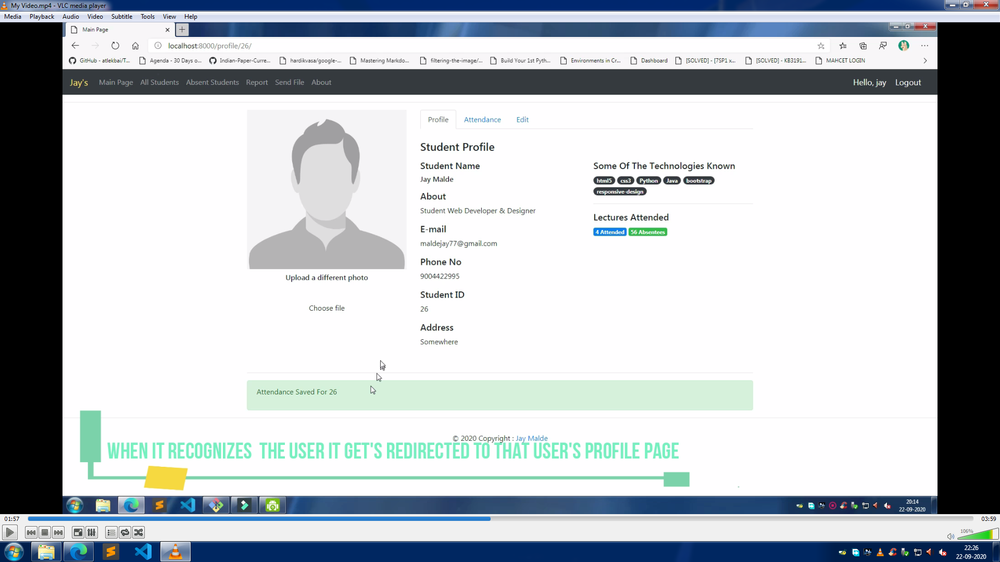

# Facial Recognition System

## Presentation Video Link
Link: [Video Link](https://www.youtube.com/watch?v=Hd5yLJnqSRI)

## Watch A Turorial By Clicking On This Link
[](https://www.youtube.com/watch?v=Hd5yLJnqSRI "Facial Recognition System")

## Overview
* A basic facial recognition project which recognizes a student's face and saves the attendance in database and a excel file.
* It also can create a report on attendance and send or save that pdf through mail with subject and title.
* It can also be a student management software and show all students with their info and attendance with a dashboard. 

## Basic Functionality
This project is divided into multiple parts:-
1. Capturing Images, Training Model and Detecting Face.
2. Dashboard That shows all students present as well as absent and a user can view, update and delete the student using dashboard.
3. It creates a excel sheets one for current attendance and another which adds the unique students.
4. A section where we can select the files and send it via mail with subject and title

## Technical Aspect
### Frontend
* HTML 
* CSS 
* BOOTSTRAP
### Backend
* Python ( backend programming language )
* Django (web development framework)
* OpenCV ( Computer Vision Library )

## Installation
The Code is written in Python 3.6 If you don't have Python installed you can find it [here](https://www.python.org/downloads/). If you are using a lower version of Python you can run this or upgrade using the pip package, ensuring you have the latest version of pip. To install the required packages and libraries, run this command in the project directory after [cloning](https://www.howtogeek.com/451360/how-to-clone-a-github-repository/) the repository:-
```bash
pip install -r requirements.txt
```
##
After cloning check that all the libraries are installed or use the .idea environment given in the repo.
For running the same project go to the project folder where the **manage.py** file is located and run the following command into the command prompt:-
```bash
python manage.py makemigrations
python manage.py migrate
python manage.py createsuperuser
python manage.py runserver
```

## Directory Tree 
```
├── face_recognition_system (application folder)
│   ├── face_rec
|       ├── migrations
|       ├── templates (html files are stored here)
|       ├── admin.py (admin related data is stored here)
|       ├── apps.py (information related to this application is stored here)
|       ├── models.py (database information is stored here)
|       ├── tests.py 
|       ├── urls.py (urls related to this project are stored here)
|       └── views.py (the working of each url is stored in a view)
│   ├── face_recognition_system (project folder)
│       ├── asgi.py
|       ├── settings.py (main file where all the information is stored)
|       ├── urls.py (urls are redirected to urls file of application)
|       └── wsgi.py (this file is used to run the project when deploying)
|   ├── requirements.txt
|   ├── Procfile (it contains info on how to run the application when deployed)
|   ├── README.md (markdown file or documentation of this project)
|   └── manage.py (this file is used to run the project on client side)
```
